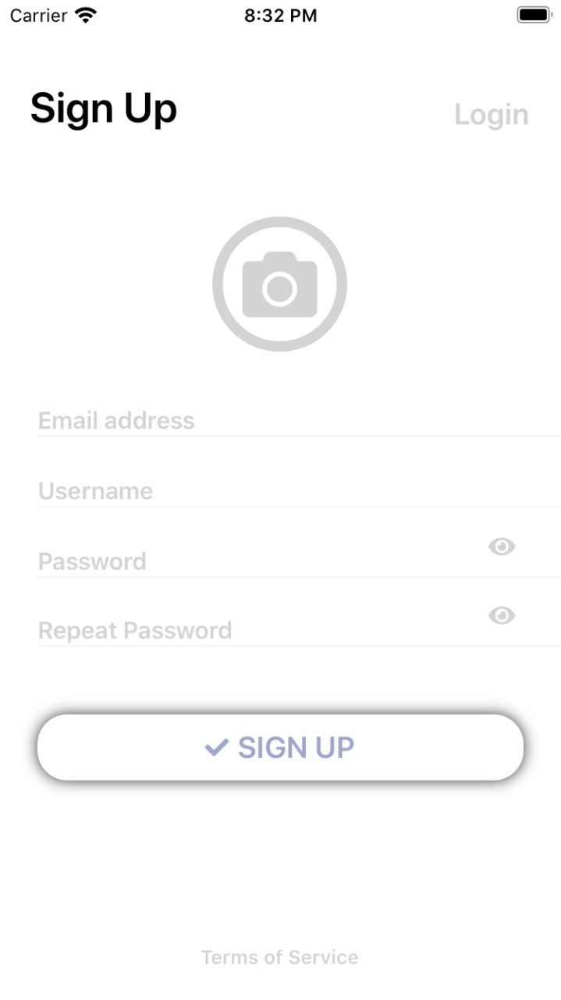
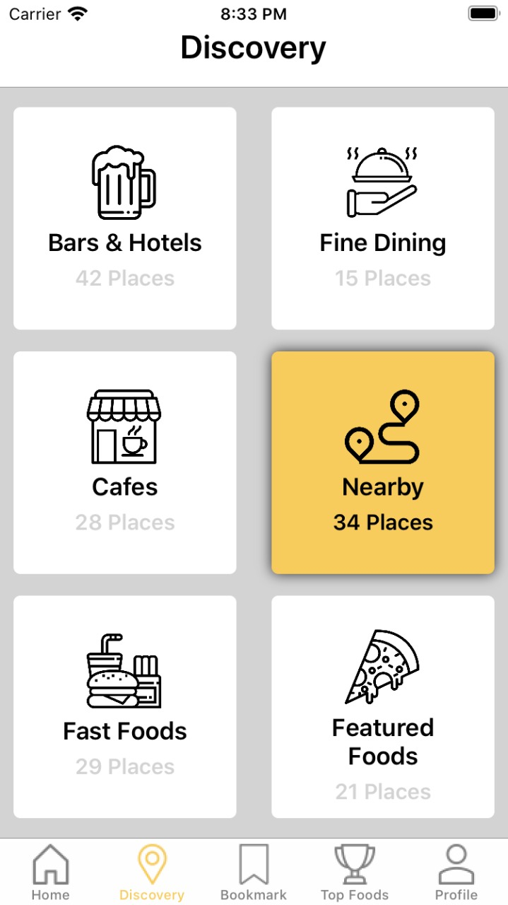
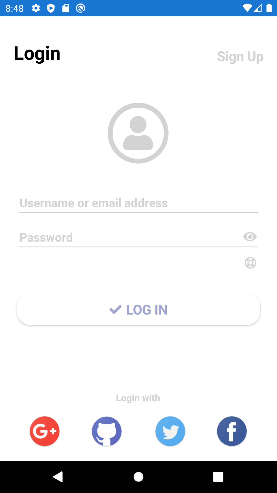
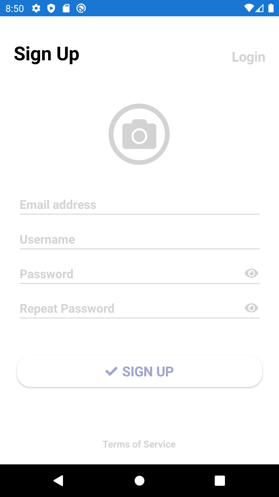
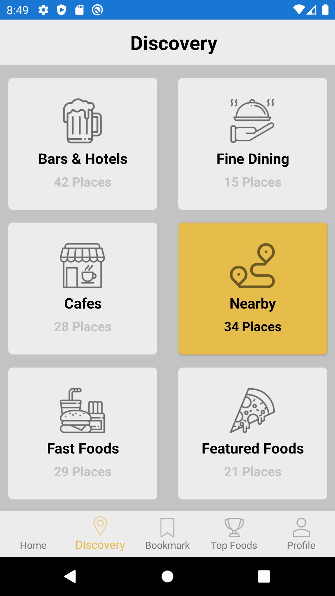

# Xamarin_TabbedPage_BasicUIs_Sample
Sample Project implementing Basic UIs with GridLayouts, TabbedPage and ContentView in Xamarin

## iOS Visuals (Iphone 8):
### Login Page

### Warning

### SignUp Page

### Main Page: Discovery Tab

## Android Visuals (Pixel 2):
### Login Page

### Warning

### SignUp Page

### Main Page: Discovery Tab

